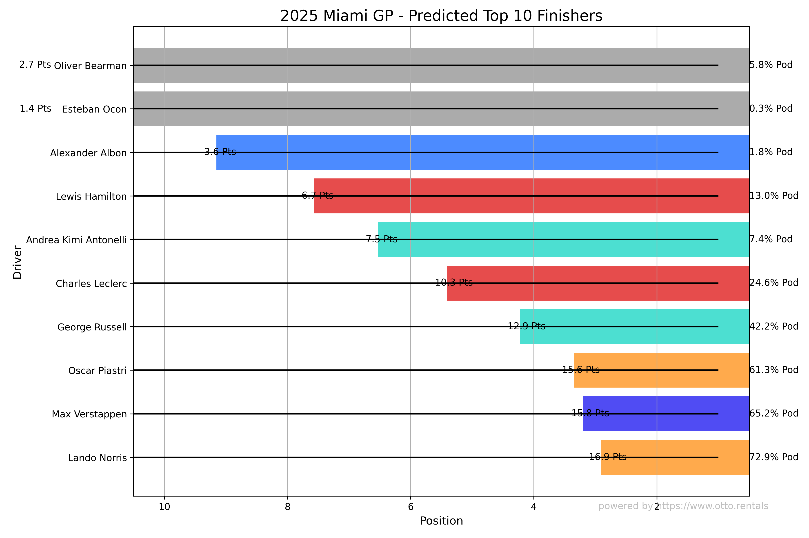

# Miami Grand Prix 2025 - F1 Race Prediction Model



## Overview

This predictive model forecasts the likely outcomes of the 2025 Miami Grand Prix using machine learning and statistical simulations. The system analyzes:

- Current season performance (2025 races)
- Historical Miami GP data (2022-2024)
- Qualifying results
- Team and driver characteristics
- Environmental factors

## Model Architecture

### Data Pipeline

1. **Input Sources**:

   - `drivers_2025.csv`: Current driver roster with team assignments
   - `2025_previous_races.csv`: Results from all 2025 races prior to Miami
   - `2025_miami_qualifiers.csv`: Official qualifying results
   - FastF1 API: Historical Miami GP data (2012-2024)

2. **Feature Engineering**:

   - Recent form (average position/points)
   - Position change trends
   - Miami-specific performance history
   - Qualifying position
   - Team performance factors
   - Weather conditions (when available)

3. **Prediction Engine**:
   - Weighted performance model combining:
     - 60% recent form
     - 30% track-specific history
     - 10% qualifying position
   - Monte Carlo simulation (1000 iterations)
   - Random Forest feature importance analysis

## Key Visualizations

The model generates several insightful visualizations:

1. **Performance Trends** - Season-long driver performance trajectories
2. **Top 10 Prediction** - Probabilistic finishing positions with confidence ranges
3. **Weather Impact** - Temperature/humidity effects on historical performance
4. **Feature Importance** - Relative weight of predictive factors
5. **Position Distribution** - Heatmap of simulated finishing probabilities

## Requirements

- Python 3.8+
- Required packages:
  ```bash
  pip install fastf1 pandas numpy scikit-learn matplotlib seaborn
  ```

## Usage

- Install dependencies:

```bash
pip install -r requirements.txt
```

- Run the prediction model:

```bash
python miami_f1.py
```

- Output Files:

  - miami_gp_predictions.csv: Complete prediction results

  - miami_gp_top10_prediction.png: Top 10 visualization

  - miami_gp_performance_trends.png: Season performance chart

  - miami_gp_weather_impact.png: Weather analysis (if data available)

  - miami_gp_feature_importance.png: Model factors breakdown

  - miami_gp_position_heatmap.png: Full position probability matrix

## Customization

Adjustable parameters in the script:

- **Simulation parameters**
   sim_count = 1000 # Number of race simulations

- **Prediction weights**
form_weight = 0.6 # Recent performance importance
track_weight = 0.3 # Track history importance
grid_weight = 0.1 # Qualifying position importance

## License

This project is provided for educational purposes under the MIT License.
